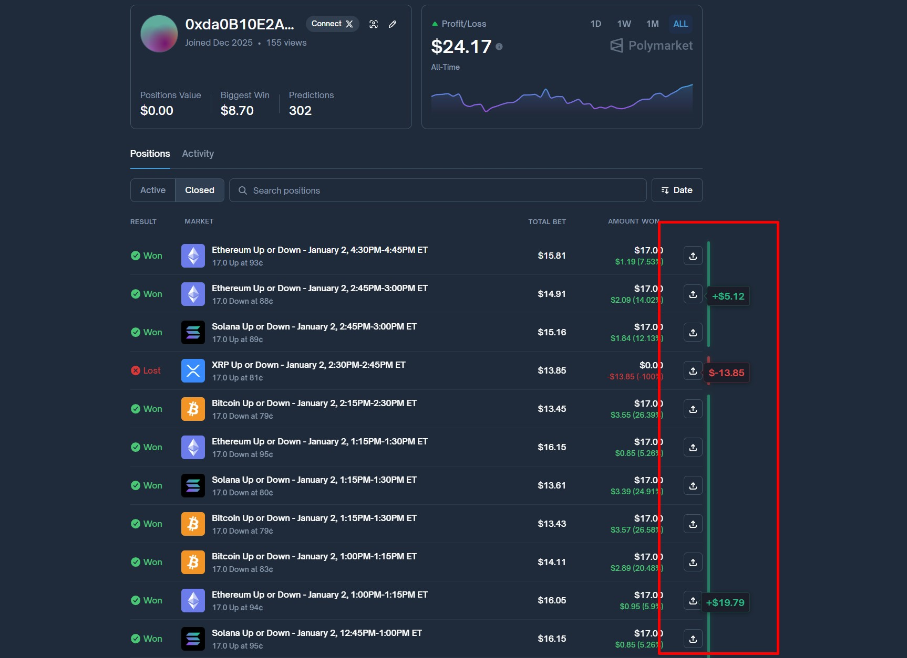

# Polymarket P&L Calculator Chrome Extension

A Chrome extension that automatically calculates and displays your total profit/loss from your Polymarket betting history.



## Features

- 📊 **Real-time P&L Calculation**: Automatically sums all your wins and losses
- 💰 **Inline Summary**: Displays total profit/loss directly in the Amount Won column header
- 📈 **Statistics**: Shows win count and loss count
- 🎨 **Beautiful UI**: Seamlessly integrates with Polymarket's existing design
- ⚡ **Auto-updates**: Updates when you load more betting history

## Installation

1. Open Chrome and navigate to `chrome://extensions/`
2. Enable **Developer mode** (toggle in the top right corner)
3. Click **Load unpacked**
4. Select the `chrome-extension` folder from this project
5. The extension is now installed!

## Usage

1. Go to [Polymarket](https://polymarket.com)
2. Navigate to your profile/betting history page
3. The P&L summary will automatically appear in the "Amount Won" column header
4. The summary shows:
   - **Total P&L**: Your total profit or loss (green for profit, red for loss)
   - **Stats**: Win count and loss count (e.g., "13W / 2L")

## How It Works

The extension:
1. Scans the Polymarket page for betting history entries
2. Extracts profit/loss amounts from each bet
3. Calculates the total sum
4. Displays the result in a fixed widget on the right side

## File Structure

```
chrome-extension/
├── manifest.json       # Extension configuration
├── content.js          # Main logic for parsing and calculation
├── styles.css          # Widget styling
└── README.md          # This file
images/
├── icon.png           # Extension icon (PNG)
└── icon.ico           # Extension icon (ICO)
```

## Troubleshooting

### Widget Not Appearing
- Make sure you're on the Polymarket betting history page
- Try refreshing the page
- Check that the extension is enabled in `chrome://extensions/`

### Incorrect Calculations
- The extension reads values as they appear on the page
- If Polymarket changes their HTML structure, the extension may need updates
- Try clicking "Load more" to ensure all bets are loaded

## Development

To modify the extension:

1. Edit the relevant files:
   - `content.js` - Change calculation or parsing logic
   - `styles.css` - Modify appearance
   - `manifest.json` - Change settings or permissions

2. Go to `chrome://extensions/`
3. Click the reload icon on the extension card
4. Refresh any Polymarket pages to see changes

## Privacy & Security

- ✅ No data is collected or sent anywhere
- ✅ No external network requests
- ✅ Only reads data from Polymarket pages you visit
- ✅ All calculations happen locally in your browser
- ✅ Open source - you can inspect all the code

## Future Enhancements

Potential features to add:
- Export P&L data to CSV
- Historical charts and graphs
- Per-crypto currency breakdown
- Time-based filtering
- Win rate calculations
- Average bet size statistics

## License

MIT License - Feel free to modify and use as you wish!

## Support

If you encounter issues or have suggestions:
1. Check the Troubleshooting section
2. Verify your Chrome version is up to date
3. Make sure Polymarket hasn't changed their page structure

---

**Note**: This extension is not affiliated with or endorsed by Polymarket. It's a community tool for personal use.

